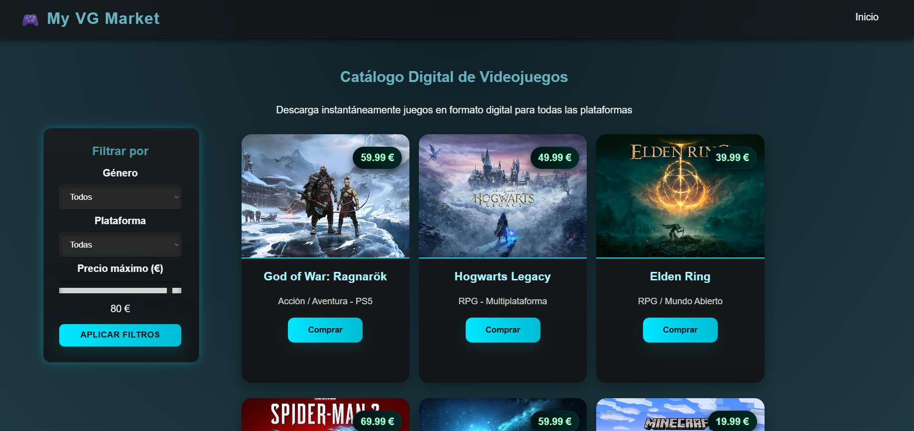

# myVG Market – Plataforma de compra y venta de videojuegos

## Descripción del proyecto
**myVG Market** es una plataforma web diseñada para la compra, venta y seguimiento de videojuegos nuevos, de segunda mano o en forma de códigos.  
El objetivo principal es crear un espacio seguro, moderno y accesible para que jugadores y coleccionistas puedan comprar y disfrutar títulos de cualquier plataforma.

La web contará con un sistema de usuarios, un catálogo interactivo, herramientas de búsqueda avanzadas y un panel para gestión de anuncios.

> “Un lugar donde cada videojuego encuentra un nuevo jugador.”

---

## Público objetivo
- Jugadores casuales que buscan ofertas.
- Coleccionistas que buscan títulos antiguos.
- Usuarios que desean vender videojuegos que ya no utilizan.
- Tiendas pequeñas que quieran mostrar su catálogo online.

---

## Funcionalidades principales
- **Registro e inicio de sesión** con autenticación segura.
- **Publicación de anuncios** con imágenes, descripción y estado del videojuego.
- **Búsqueda avanzada** por plataforma, precio, estado o género.
- Sistema de **favoritos** y seguimiento de vendedores.
- Chat interno para comunicación entre compradores y vendedores.

### Lista no numerada
- Catálogo dinámico
- Filtro por categorías
- Puntuación de vendedores
- Soporte multiplataforma

### Lista numerada – Fases iniciales del desarrollo
1. Diseño de la estructura del proyecto.
2. Creación del backend (API + base de datos).
3. Desarrollo del frontend y maquetación.
4. Integración de funcionalidades principales.
5. Pruebas y despliegue en producción.

---

## Tecnologías previstas

### Frontend
- **HTML5**, **CSS3** y *JavaScript*.
- Framework previsto: **Figma**.
- Diseño responsivo con TailwindCSS.

### Backend
- API en **Node.js**.
- Base de datos en **MongoDB**.
- Control de usuarios con JWT.

---

## Ejemplo de código
```html
<div class="game-card">
  <h3>{{ title }}</h3>
  <p>Plataforma: {{ platform }}</p>
  <button>Ver detalles</button>
</div>


